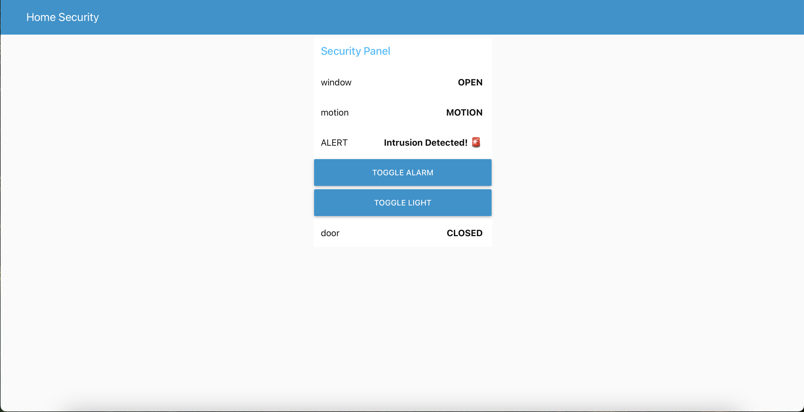
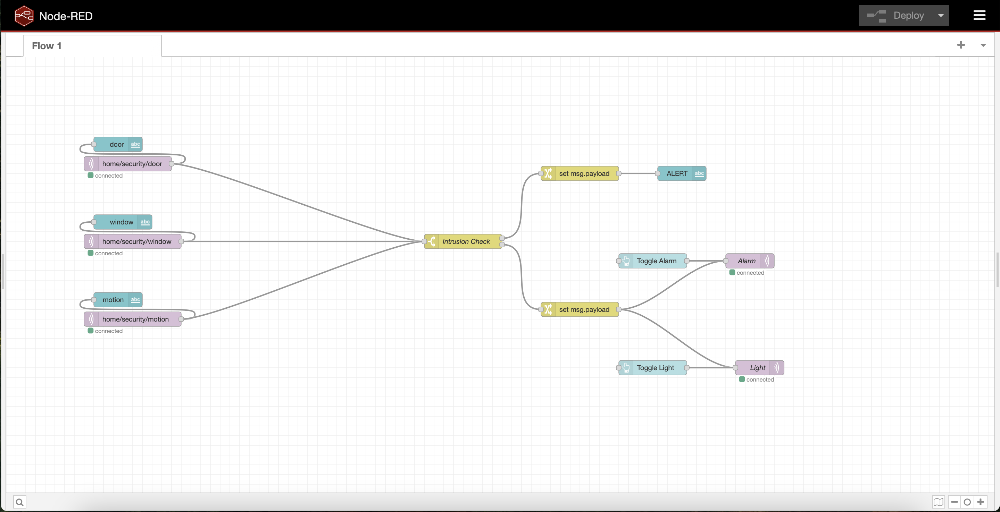

# IoT Security System Simulation

## 📌 Overview
This project demonstrates an **IoT-based Home Security System** using **MQTT** for communication and **Node-RED** for visualization and control.  
It simulates **door, window, and motion sensors**, detects intrusions, and triggers virtual actuators (**alarm and light**) via MQTT.

---

## 🛠️ Features
✅ Door, window, and motion sensors that publish data via MQTT  
✅ Persistent MQTT sessions (`clean_session=False`) for reliable delivery  
✅ Node-RED dashboard displaying live sensor states  
✅ Intrusion detection logic with alerts  
✅ Virtual actuators (alarm and light) controlled by MQTT messages  
✅ Manual ON/OFF buttons for actuators in the dashboard  
✅ Fully documented and modular Python codebase  

---

## 📂 Folder Structure
```
IoT-Security-System-Simulation/
├── app/
│   ├── mqtt_client.py         # Creates reusable MQTT client
│   ├── door_sensor.py         # Simulates door sensor
│   ├── window_sensor.py       # Simulates window sensor
│   ├── motion_sensor.py       # Simulates motion sensor
│   └── actuator_listener.py   # Listens to actuator commands
├── config/
│   └── settings.env           # MQTT broker settings
├── requirements.txt           # Dependencies
├── README.md                  # Project documentation
├── .gitignore
└── flows.json                 # Node-RED flow (import this into Node-RED)
```

---

## 🚀 How It Works

### 🔹 1. Sensors (Python Scripts)
- **door_sensor.py** → Publishes `OPEN` / `CLOSED` to `home/security/door`  
- **window_sensor.py** → Publishes `OPEN` / `CLOSED` to `home/security/window`  
- **motion_sensor.py** → Publishes `MOTION` / `NO_MOTION` to `home/security/motion`

### 🔹 2. Node-RED Dashboard
- Displays live sensor states  
- Detects intrusion when any sensor reports a threat  
- Publishes `ON` / `OFF` to actuators (`home/security/alarm` and `home/security/light`)  

### 🔹 3. Actuator Listener (Python)
- Subscribes to actuator topics and prints messages when alarm/light are toggled.

---

## 🖥️ Node-RED Dashboard Example



---

## ⚙️ Setup Instructions

### 1️⃣ Clone and Install Dependencies
```bash
git clone <repo-url>
cd IoT-Security-System-Simulation
python3 -m venv venv
source venv/bin/activate
pip install -r requirements.txt
```

### 2️⃣ Start Mosquitto MQTT Broker
```bash
brew services start mosquitto
```

### 3️⃣ Run Sensors (Each in Separate Terminal)
```bash
python -m app.door_sensor
python -m app.window_sensor
python -m app.motion_sensor
```

### 4️⃣ Run Actuator Listener
```bash
python -m app.actuator_listener
```

### 5️⃣ Import Node-RED Flow
- Go to **http://127.0.0.1:1880/**
- Menu → Import → Select `flows.json`
- Click **Deploy**

### 6️⃣ Open Dashboard
Go to **http://127.0.0.1:1880/ui**  
You will see:
- Live sensor values  
- Intrusion alert when triggered  
- Buttons to toggle alarm and light  

---

## 📚 Learning Topics
To understand this project, learn about:
- **IoT and MQTT Basics** (publish/subscribe, QoS, persistent sessions)  
- **paho-mqtt Python library**  
- **Node-RED dashboard & flow-based programming**  
- **JSON-based data communication in IoT**

See [`Learning_Guide_IoT_MQTT.txt`](Learning_Guide_IoT_Security.txt) for a beginner-friendly explanation.

---

## 📸 Screenshots

### Node-RED Flow


### Dashboard


---

## 📜 License
MIT License
